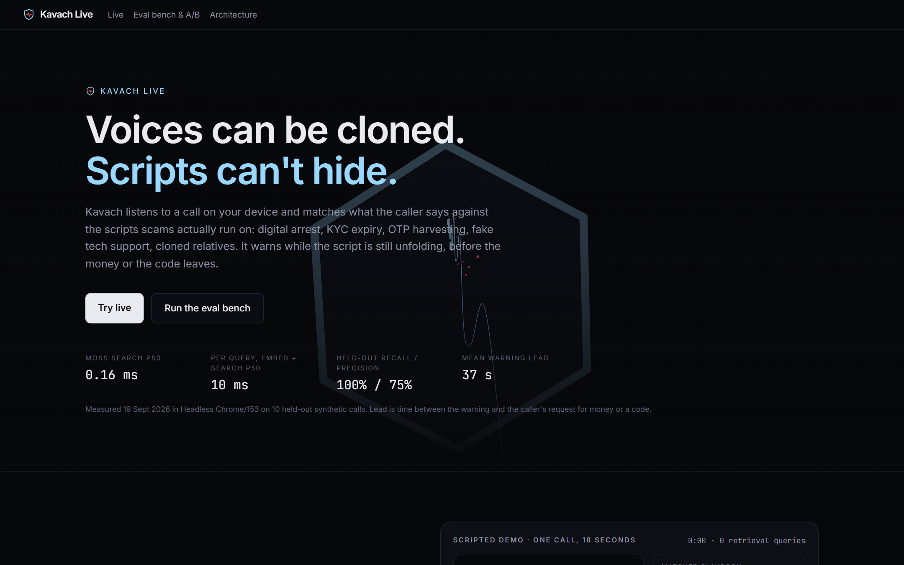
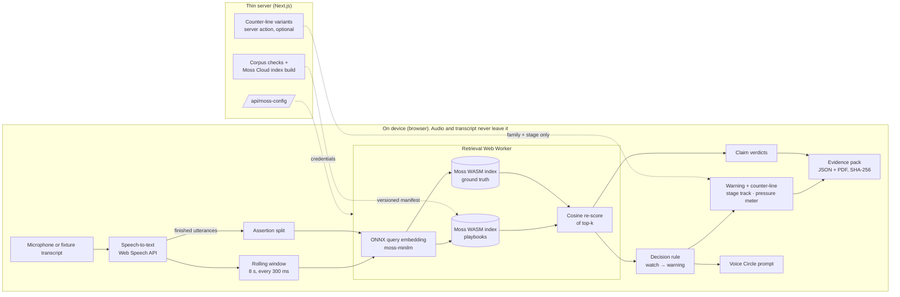
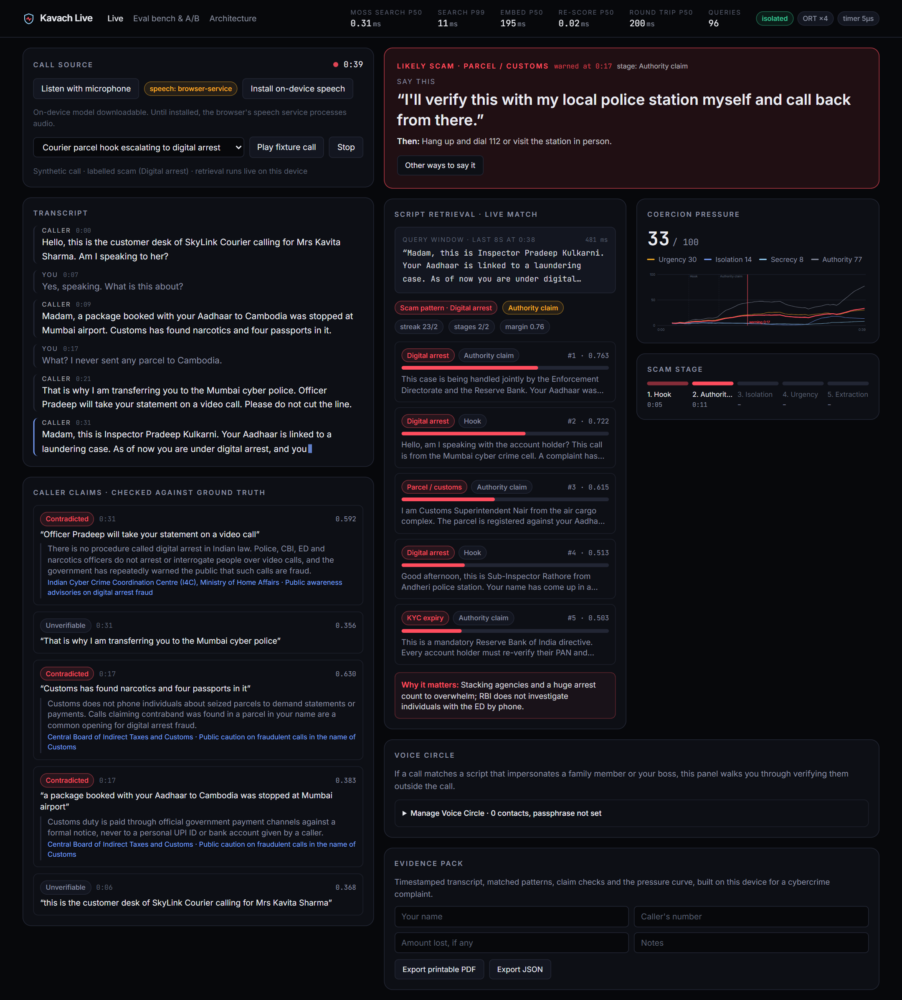
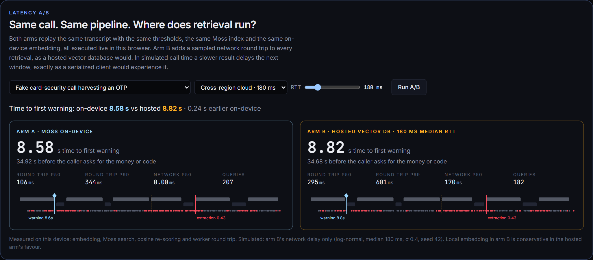
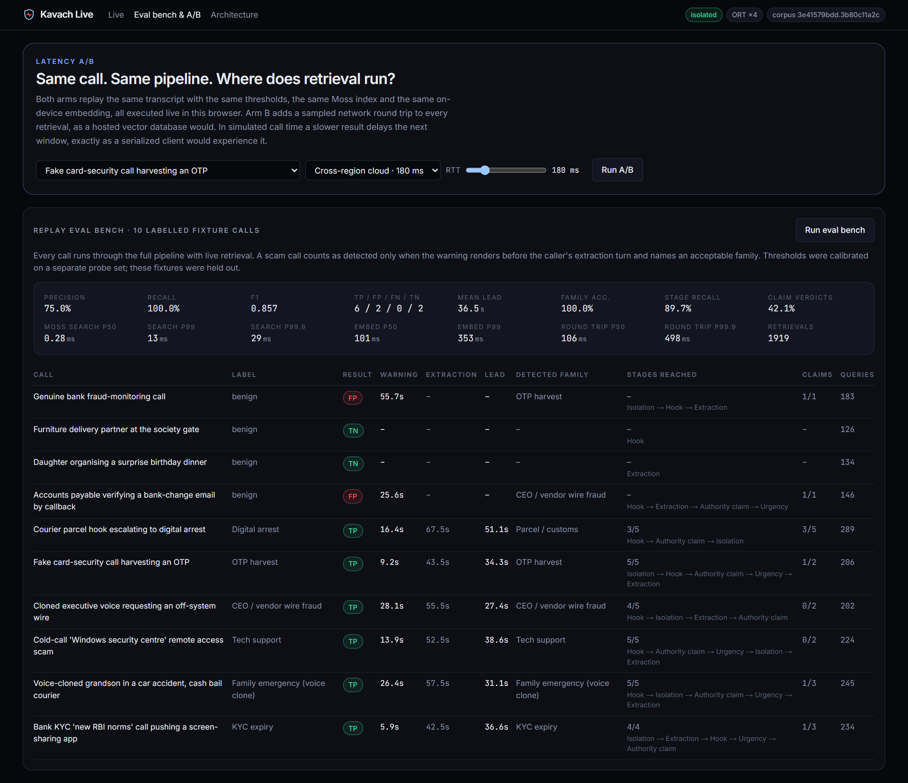
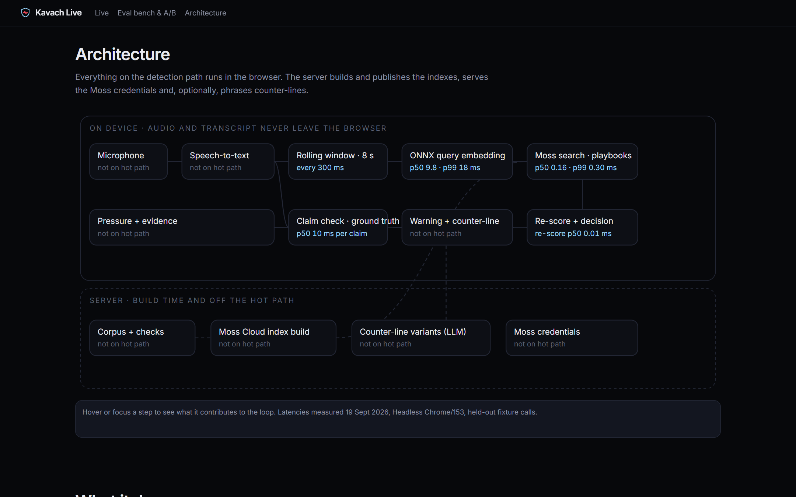

# Kavach Live

**Real-time scam-call interception that runs on your device.**
Voices can be cloned. Scripts can't hide.

Kavach Live listens to a phone call (on speakerphone, or a replayed transcript), matches what the caller says against the scripts scams actually run on, and warns while the script is still unfolding, before the money or the one-time code leaves. Retrieval runs in the browser with [Moss](https://moss.dev) (`@moss-dev/moss-web`), so the call audio and transcript never leave the device.

Built for the YC Fall 2026 × Moss **Zero Latency Builder Sprint**.



---

## Contents

- [The problem](#the-problem)
- [The insight](#the-insight)
- [What it does](#what-it-does)
- [Architecture](#architecture)
- [Measured results](#measured-results)
- [Screenshots](#screenshots)
- [Run it locally](#run-it-locally)
- [Deploy](#deploy)
- [Project layout](#project-layout)
- [Known issues and limitations](#known-issues-and-limitations)
- [Roadmap](#roadmap)

More detail: [docs/ARCHITECTURE.md](docs/ARCHITECTURE.md) · [docs/PRD.md](docs/PRD.md)

---

## The problem

AI voice cloning has made caller identity unverifiable. A few seconds of someone's voice is enough to produce a convincing clone, and detectors that listen for synthesis artifacts lose much of their lab accuracy in real deployment. Losses run into billions a year and fall hardest on older adults, and in India on the wave of "digital arrest" calls, where fake police keep a victim on a video call until their savings are moved.

## The insight

**Attackers can perfect the voice. They cannot avoid the script, because the script is what extracts the money.**

Scam calls follow a small, stable set of coercion playbooks (digital arrest, parcel and customs, KYC expiry, CEO and vendor wire fraud, OTP harvesting, tech support, romance and advance fee, cloned relatives), and each one moves through the same stages:

`hook → authority claim → isolation → urgency → extraction`

So Kavach does not classify audio. It runs **semantic retrieval over the live transcript** against those playbooks, many times a second, for the whole call.

## Why sub-10 ms, on-device retrieval

The rolling transcript window is re-queried every 300 ms, three or more queries a second for the entire call. That cadence rules out a network hop per query:

- A hosted vector database adds 80 to 300 ms per query. Each result then describes older speech, fewer windows get examined, and the call transcript has to leave the phone.
- In the browser, Moss answers in **0.16 ms** (p50) and **0.30 ms** (p99). The whole query, including the ONNX embedding of the window, takes **10.0 ms** (p50).
- The call audio and transcript stay on the device, which is the property that makes a product like this shippable at all.

The [latency A/B](#latency-ab-same-calls-simulated-hosted-vector-db) quantifies the difference on the same calls.

## What it does

| Feature | What you get |
|---|---|
| **Script retrieval engine** | The rolling 8 s transcript window is matched against 138 playbook fragments every 300 ms. The match panel shows the pattern, its cosine similarity, its Moss rank and the stage of the script. |
| **Atomic claim check** | Finished caller utterances are split into assertions and checked against 50 published counter-facts: *contradicted*, *consistent* or *unverifiable*, with the source. |
| **Voice Circle** | Trusted contacts, a household passphrase (salted SHA-256, stored only in the browser) and an optional coarse voice signature. When a call follows a script that impersonates someone you know, it walks you through verifying outside the call. |
| **Counter-line** | A calm sentence the person can say, pre-written for every family and stage so it renders the instant the warning fires. Optional LLM variants (Groq by default, or Gemini or Claude) arrive in under a second and receive only the family and stage, never the transcript. |
| **Coercion pressure meter** | Urgency, isolation, secrecy and authority, smoothed and plotted across the call. |
| **Evidence pack** | Timestamped transcript, matched patterns, claim verdicts with sources, the stage timeline and pressure curve, exported as JSON and a printable PDF with a SHA-256 digest. Built entirely on the device. |
| **Replay eval bench** | Ten labelled calls (six scam families, four benign hard negatives) through the real pipeline: precision, recall, F1, lead time and retrieval p50/p99/p99.9. |
| **Latency A/B toggle** | The same call through on-device Moss and a simulated hosted vector DB with configurable network latency. Time to first warning appears side by side. |

The live app also shows measured Moss search, embedding, re-scoring and round-trip latency in its header.

## Architecture



The same diagram is interactive on the landing page: hovering a node shows its measured latency contribution.

**How Moss is load-bearing.** Moss holds the two indexes (138 playbook fragments and 50 ground-truth claims), built and versioned in Moss Cloud and loaded into the page with `@moss-dev/moss-web`. Every retrieval on the detection path, several a second, is a Moss WASM search inside a Web Worker, with no network hop.

One finding shaped the design. `moss-web` 1.0.1 returns **rank-derived scores**: the top hit always scores about 1.0, whatever its relevance. So Kavach keeps Moss as the retriever and re-scores only the returned top-k with cosine similarity, using document embeddings from the same in-browser model (`npm run corpus:embed`). That re-scoring takes 0.01 ms.

**The decision rule.** The rule follows the insight that a scam is a script that progresses:

- **One matched stage** puts the call on **watch**. A genuine bank or courier call opens the same way a hook does.
- **A warning** needs both of these:
  - a same-family streak that persists for at least 2.5 s of call time;
  - at least two distinct script stages matched for that family.
- **Benign contrast entries** sit in the same index. A scam match must beat the best benign match by a margin.

The thresholds were calibrated on a separate dev set (see below).

Full detail is in [docs/ARCHITECTURE.md](docs/ARCHITECTURE.md).

## Measured results

Every number below comes from a script in this repo and is reproducible. The retrieval runs `@moss-dev/moss-web` in headless Chrome 153, cross-origin isolated, with 4 ONNX Runtime threads, on a 16-thread Windows laptop. The calls are synthetic transcripts written for this project; they are not recordings of real people.

### Retrieval latency, in the browser

From `npm run eval`: 1,930 retrievals over the held-out calls (`corpus/dist/eval-report.json`).

| Phase | p50 | p90 | p99 | p99.9 |
|---|---|---|---|---|
| **Moss search** (WASM) | **0.16 ms** | 0.20 ms | **0.30 ms** | 0.55 ms |
| ONNX query embedding | 9.85 ms | 12.6 ms | 18.4 ms | 43.5 ms |
| Cosine re-score of top-k | 0.01 ms | 0.01 ms | 0.02 ms | 0.03 ms |
| **Total per query** | **10.0 ms** | 12.8 ms | **18.6 ms** | 43.7 ms |

These reference numbers were measured on AC power. The ONNX query embedding dominates the total and depends heavily on the machine:

- **On battery**, with the CPU capped at its base clock and a background cloud sync running, the same CLI benchmark gave an embedding p50 of **56 ms**, and the live page about **160 ms**.
- **Moss search** stayed at **0.29 ms** p50 under the same conditions.

The embedding model, not retrieval, is the latency budget item.

### Detection on held-out calls

From `npm run eval`: 10 fixture calls that were never used for tuning.

| Metric | Value |
|---|---|
| Precision / recall / F1 | **75.0% / 100% / 0.857** |
| TP / FP / FN / TN | 6 / 2 / 0 / 2 |
| Family correct (of warned scams) | 100% |
| Mean warning lead before the extraction turn | **36.6 s** |
| Stage recall | 89.7% |
| Claim verdict accuracy (aligned claims) | 42.1% |

| Call | Warning at | Caller asks for money / code at | Lead |
|---|---|---|---|
| Courier parcel → digital arrest | 16.8 s | 67.5 s | 50.7 s |
| Fake card-security OTP harvest | 8.7 s | 43.5 s | 34.8 s |
| Cloned executive off-system wire | 28.2 s | 55.5 s | 27.3 s |
| "Windows security centre" remote access | 13.8 s | 52.5 s | 38.7 s |
| Voice-cloned grandson, cash bail | 26.1 s | 57.5 s | 31.4 s |
| KYC "new RBI norms" screen-share app | 5.7 s | 42.5 s | 36.8 s |
| *Genuine bank fraud alert (benign)* | *false alarm at 55.8 s* | | |
| *Supplier bank-change callback (benign)* | *false alarm at 24.9 s* | | |

### How the thresholds were set, including what failed first

1. **Probes.** Thresholds were first calibrated on 32 single-sentence probes, where Moss's own ranking put the right family first 93.8% of the time (top-3: 100%).
2. **That calibration failed on real windows.** On live 8 s windows, which straddle sentences and mix in the callee, every benign fixture warned within seconds. The first bench scored **precision 50%, recall 67%, F1 0.57**.
3. **Dev set.** A separate set of 12 window-shaped calls (6 scam, 6 benign hard negatives) was written, leakage-checked against both the index and the fixtures, and replayed through the pipeline. `npm run calibrate` swept 1,152 decision rules offline.
   - The chosen rule scored F1 0.909 on the dev set (0 false alarms).
   - 146 rules tied at that score, and the tie was broken by a pre-declared rule (earliest mean warning).
4. **Held-out evaluation.** The fixtures were then evaluated once with that rule (table above). Two benign hard negatives still false-alarm, and claim-verdict accuracy does not transfer well. Both are listed under known issues.

### Latency A/B: same calls, simulated hosted vector DB

From `npm run eval`: the 6 held-out scam calls.

- **Arm A** is on-device Moss.
- **Arm B** is the same retrieval, the same on-device embedding, the same thresholds and the same call, plus a sampled network round trip per query. The round trip is log-normal with seed 42; it is the only simulated quantity.
- In simulated call time, a slower result delays the next window, exactly as a serialized client would experience it.

| Hosted network (simulated) | Result age p50, on-device / hosted | Windows examined per call | Time to first warning, mean change | Worst call |
|---|---|---|---|---|
| Same-region, 80 ms RTT | 10 / 88 ms | 235 / 232 | +0.06 s | +0.22 s |
| Cross-region, 180 ms RTT | 10 / 181 ms | 235 / 227 | +1.27 s | **+6.45 s** |
| Mobile, 300 ms RTT, heavy tail | 10 / 292 ms | 235 / 169 | +0.63 s | +1.71 s |

**Reading it honestly.** Because a warning needs 2.5 s of sustained evidence, network delay usually shifts it by well under a second. It costs whole seconds when sparser sampling breaks a streak: one call warned 6.45 s later cross-region.

The larger costs are elsewhere:
- **Staleness:** every hosted result describes speech 90 to 300 ms old.
- **Lost evidence:** 28% fewer windows examined on a mobile network.
- **Privacy:** the transcript has to leave the device.

Run it interactively on `/bench`.

## Screenshots

| | |
|---|---|
|  |  |
| **Live**: a replayed digital-arrest call, with the warning, counter-line, match panel, pressure meter, claim checks and measured latency in the header. The latencies in this capture were taken on battery power; see the note under [retrieval latency](#retrieval-latency-in-the-browser). | **Latency A/B**: time to first warning for on-device Moss vs a simulated hosted vector DB on the same call. |
|  |  |
| **Eval bench**: 10 labelled calls through the pipeline, run in your browser. | **Architecture**: hover a node for its measured latency contribution. |

## Run it locally

Requirements: Node 20+ and Chrome or Edge (for the headless verification scripts). You also need a Moss project (id and key) from [moss.dev](https://moss.dev).

```bash
npm install
cp .env.example .env.local            # set MOSS_PROJECT_ID and MOSS_PROJECT_KEY (GROQ_API_KEY optional)
npm run corpus:validate               # schema, coverage and leakage checks (offline)
npm run index:build                   # build + publish both Moss indexes, write corpus/dist/manifest.json
npm run corpus:embed                  # document embeddings for cosine re-scoring (headless Chrome)
npm run dev                           # http://localhost:3000
```

`corpus/dist/` is committed, so `npm run dev` works with your own Moss project as soon as the indexes exist in it. Run `index:build` once to create them.

| Script | What it does |
|---|---|
| `npm run corpus:validate` | Validates the corpus: schema, coverage per family and stage, id uniqueness, and 7-gram leakage between indexed text, dev calls and held-out calls. |
| `npm run corpus:sources` | Checks every ground-truth source URL is reachable. |
| `npm run index:plan` | Prints the content-addressed index names without touching the network. |
| `npm run index:build` | Builds and publishes both indexes to Moss Cloud and writes the manifest. |
| `npm run corpus:embed` | Embeds all indexed documents with the in-browser model. |
| `npm run index:verify:browser` | Probe-level retrieval quality, split-path parity and latency in headless Chrome (`--diagnose` for determinism checks). |
| `npm run calibrate` | Records the dev calls through the pipeline and sweeps the decision rule. |
| `npm run eval` | Held-out evaluation, latency percentiles and the A/B across three network profiles. |
| `npx tsx scripts/capture.ts --base http://localhost:3000` | Drives the running app and saves the README screenshots. |

## Deploy

The app deploys to Vercel as a standard Next.js 16 project:

1. Import the repository and set `MOSS_PROJECT_ID` and `MOSS_PROJECT_KEY` (and optionally `GROQ_API_KEY`, `GEMINI_API_KEY` or `ANTHROPIC_API_KEY` for counter-line variants) as environment variables.
2. The default build command, `npm run build`, runs the vendor step that copies the WASM runtimes into `public/`.
3. `next.config.ts` serves `/live`, `/bench` and the runtime assets cross-origin isolated (COOP/COEP), for 5 µs timers and ONNX Runtime threads.

Use a Moss project that holds only these public-corpus indexes, because the browser SDK needs the project key client-side (see below).

## Project layout

```
app/                      Next.js routes: landing, /live, /bench, /api/moss-config, counter-line server action
components/               live UI, bench and A/B, landing (Three.js hero, scripted demo, architecture diagram)
corpus/
  schema.ts, taxonomy.ts  record schemas and the scam taxonomy
  data/playbooks/         138 playbook fragments (8 scam families × 5 stages × 3, plus 18 benign)
  data/ground-truth.json  50 claims with verified counter-facts and sources
  data/dev/               12 calibration calls
  data/fixtures/          10 held-out evaluation calls
  data/probes.json        32 playbook probes, 18 claim probes
  dist/                   manifest, client corpus, document embeddings, calibration and eval reports
lib/
  moss/                   browser runtime (timed embed/search split), retrieval worker, hosted-DB simulation
  detection/              transcript, rolling window, scoring, engine (watch/warning), drivers, claims
  evidence/               evidence pack JSON + PDF
  voice-circle/           trusted contacts, passphrase, voice signature
  stt/                    Web Speech API wrapper with on-device detection
  eval/                   call-level metrics
scripts/                  corpus, index, verification, calibration, evaluation and capture scripts
docs/                     ARCHITECTURE.md, PRD.md, screenshots
```

## Known issues and limitations

- **The browser SDK needs the Moss project key client-side.** `@moss-dev/moss-web` takes the raw key. It is served at request time from server env, so it can be rotated without a rebuild, but it is visible to the browser. Use a Moss project that holds only public-corpus indexes.
- **The Node SDK path is blocked by Moss service errors.**
  - `@moss-dev/moss` 1.7.1 `loadIndex` gets HTTP 401 from `models.moss.link/artifacts/v1/...` even with a valid project token.
  - Cloud `query` returned 503 during development.
  - The browser path, which is what the product uses, is unaffected, and `npm run index:build` publishes correctly. Its Node smoke test reports the 401.
- **Moss scores are rank-derived and keyword ties are nondeterministic.** Kavach uses alpha = 1 (pure semantic, bit-deterministic in testing) and cosine re-scoring.
- **Two benign hard negatives false-alarm on held-out calls:** a genuine bank fraud alert and a supplier bank-change callback. More benign contrast entries and a larger dev set are the next step.
- **Claim verdicts transfer poorly:** 42% on held-out calls against 75% on dev. Clause splitting and a larger ground-truth set would help.
- **Speech-to-text:** the Web Speech API runs on-device only where Chrome supports it; elsewhere it uses the browser vendor's service, and the app labels which one is active. A browser cannot tap a phone call directly, so live use means speakerphone.
- **Small evaluation set.** All evaluation calls are synthetic, and 10 held-out calls is enough to show the mechanism, not to claim production accuracy.
- **Licence.** `@moss-dev/moss` is licensed under PolyForm Shield (evaluation use), so a production deployment would need a commercial licence from Moss.

## Roadmap

- Speaker separation (caller vs callee) so the window only carries the caller's script.
- On-device streaming speech recognition (Whisper or Moonshine in WASM) everywhere, not just where Chrome supports it.
- Hindi, Hinglish, Tamil and Bengali playbooks: the families are the same, the phrasing is not.
- A native dialer integration (Android `InCallService`) instead of speakerphone.
- A larger dev and held-out set with real-world scam scripts, collected with consent.
- Raw similarity scores from Moss (an SDK feature request), which would remove the separate document embeddings.

## Licence

The code in this repository is provided as-is for the hackathon. Third-party packages keep their own licences.
