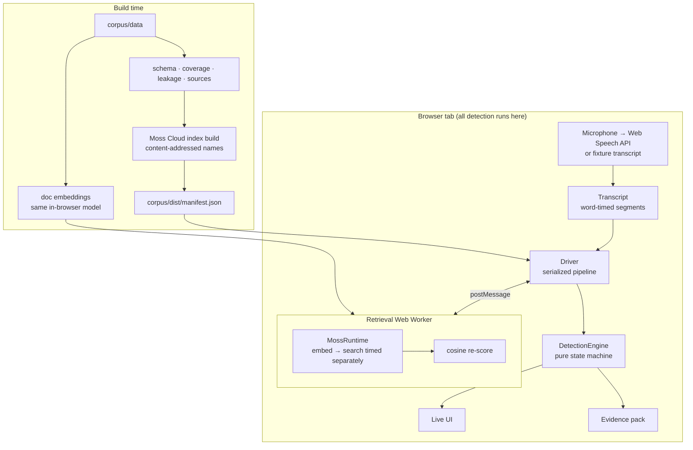

# Kavach Live architecture

This document describes how Kavach Live works, why each piece is shaped the way it is, and how every number it reports is measured. For the product case see [PRD.md](PRD.md); for setup see the [README](../README.md).

## 1. Shape of the system

- **Detection path: browser only.** Speech-to-text, the rolling window, the query embedding, Moss search, re-scoring, the decision rule and the evidence pack all run in the tab. None of them makes a network request per query.
- **Server: thin.**
  - Index build and publishing happen at build time.
  - `/api/moss-config` serves the Moss credentials the browser SDK needs.
  - An optional server action generates counter-line variants with an LLM (Gemini by default, Claude as a fallback). It sends only the scam family and stage.

## 2. Corpus

| Set | Size | Used for | Location |
|---|---|---|---|
| Playbooks | 138 fragments: 8 scam families × 5 stages × 3, plus 18 benign contrast entries | Moss index `playbooks` | `corpus/data/playbooks/*.json` |
| Ground truth | 50 claims with verified counter-facts and sources (42 refute, 8 support) | Moss index `ground_truth` | `corpus/data/ground-truth.json` |
| Dev calls | 12 (6 scam, 6 benign hard negatives) | Calibrating the decision rule | `corpus/data/dev/` |
| Fixture calls | 10 (6 scam across 6 families, 4 benign hard negatives) | Held-out evaluation only | `corpus/data/fixtures/` |
| Probes | 32 playbook + 18 claim utterances | Retrieval-quality checks | `corpus/data/probes.json` |

**Playbook entries.** Each entry is a 15–60 word fragment of what a caller says. That length matches an 8-second window, so cosine similarity is not diluted by length. Each entry carries:
- `family`, `stage` and `severity`;
- `impersonates`, which is `known_contact` for Voice Circle triggers;
- intensities from 0 to 3 for urgency, isolation, secrecy and authority, used by the pressure meter;
- a `tell` explaining why the fragment is suspicious.

**Ground-truth entries.** The embedded text is the claim as a caller would assert it, because the query is always an assertion. The verified fact and its source are joined back in by id.

**Checks** (`corpus/load.ts`, `npm run corpus:validate`):
- Zod schemas for every record, including realistic speech rate for timed turns.
- Coverage: at least 2 entries per family and stage, and at least 12 benign entries.
- Referential integrity between claims and ground truth.
- **Leakage:** no 7-word sequence may be shared between indexed text, dev calls and held-out text. This check caught three accidental overlaps while the dev set was being written.
- `npm run corpus:sources` checks every source URL (publisher pages; bot-protected hosts are reported as unconfirmed rather than dead).

## 3. Index build and versioning

`scripts/build-index.ts` maps records to Moss documents. Metadata holds only filterable fields (`family`, `stage`, `severity`, `impersonates`, `locale`) because Moss metadata is string-only.

Index names are **content-addressed**, for example `kavach-playbooks-3e41579bdd`. The name is a hash of the schema version, model, ids, text and metadata. A published index therefore never changes underneath a running client: any edit to the corpus produces a new name, and `corpus/dist/manifest.json` is the pointer the app follows. It records the previous names for rollback, and `--prune` removes older ones. The build creates indexes in Moss Cloud with `moss-minilm`, confirms each is `Ready` with the expected document count and model, then writes the manifest.

## 4. Browser retrieval runtime

`lib/moss/runtime.ts` wraps `@moss-dev/moss-web` 1.0.1. Internally, `MossClient.query()` is `embedder.embed(text)` followed by `indexManager.query(...)`, and the runtime calls those two steps directly so that embedding and search are timed separately.

`scripts/verify-browser.ts` checks that this split path is equivalent to the public `query()`: 12 of 12 results were identical, with a maximum score delta of 0, at alpha 1.

- **Worker.** The runtime runs in a module Web Worker (`lib/moss/worker.ts`, bundled with esbuild into `public/vendor/kavach/worker.js`). Requests are serialized because an ONNX inference session must not run concurrently with itself.
- **Assets.** The WASM runtimes are served same-origin from `public/vendor`. ONNX Runtime is pinned to its WASM-only build (`onnxruntime-web/wasm`), which avoids loading a second 28 MB runtime.
- **Isolation.** `/live`, `/bench` and the assets are served with `Cross-Origin-Opener-Policy: same-origin` and `Cross-Origin-Embedder-Policy: credentialless`. That gives 5 µs timer resolution, instead of 100 µs, so sub-millisecond latencies can be measured honestly, and lets ONNX Runtime use threads.

### Findings about Moss scores

`scripts/verify-browser.ts --diagnose` established two things.

1. **Scores are rank-derived.**
   - Each component scores `31 / (30 + rank)`, and the components are fused by alpha.
   - The top hit therefore always scores about 1.0, however relevant it is.
   - As a result, scores cannot be thresholded to mark a claim unverifiable, to separate scam from benign, or to display a confidence.
2. **The keyword component is nondeterministic.** It breaks score ties differently between calls, so at alpha < 1 the same query can reorder its hits. Alpha 1 (pure semantic) is bit-deterministic, and ONNX embeddings were bit-identical at 1 and 4 threads.

So Kavach uses Moss for retrieval at alpha 1, and re-scores the top-k it returns by cosine similarity. The document vectors come from `npm run corpus:embed`, which embeds every indexed document with the same in-browser model (188 × 384 float32, 382 KB). Re-scoring takes 0.01 ms.

## 5. Detection pipeline

### Transcript and window

`lib/detection/transcript.ts` stores segments with start and end call times and interpolates word times linearly within each segment. That works for both sources:
- fixture turns carry their own timing;
- live speech segments are stamped as recognition results arrive.

The retrieval window is the words spoken in the last 8 s.

### Drivers

`lib/detection/drivers.ts` runs one serialized pipeline in two modes:

1. Pending claim checks run first, then one playbook query for the current window, with at most one retrieval in flight.
2. The window is re-queried every 300 ms, but only when it has changed.

- **`RealtimeSession`** runs on the wall clock, for the microphone and for 1× fixture playback.
- **`runSimulatedCall`** runs a fixture in *simulated call time*. Each result is applied at `issuedAt + latency`, and the next window cannot be issued before the previous result arrives. This lets two retrievers be compared on the same call without sharing the device, and it is how the latency A/B works.

### Scoring and the decision rule

`lib/detection/scoring.ts` and `engine.ts` compute the following for each result.

**Assessment:**
- the best scam entry and the best benign entry by cosine, and the margin between them;
- whether the result is a **scam signal**: best scam cosine ≥ `scamMin` and margin ≥ `benignMargin`. Windows shorter than `decisionMinWords` words never count.

**Streak and watch:**
- The streak counts consecutive scam signals naming the same family. A change of family resets it.
- Any signal puts the call on **watch**, which holds for 4 s after the last signal. The UI shows an amber "possible script" state.

**Warning:** fires when both of these hold:
- the same-family streak has at least `warnConsecutive` results and spans at least `warnMinSpanSeconds` of call time;
- the family has matched at least `minDistinctStages` distinct stages (plus a coercion stage when `requireCoercion` is on).

**Other outputs:**
- Stage progress per family; the stage track shows the leading family.
- A coercion pressure curve: relevance-weighted signal intensities of relevant scam entries, scaled by the best scam relevance minus the best benign relevance, smoothed with a 3 s time constant.
- The Voice Circle trigger: a sustained streak on an entry with `impersonates: known_contact`.

### Calibration

Probe-calibrated thresholds warned on every benign call within seconds, because live windows straddle sentences. `scripts/calibrate.ts` fixes this with window-shaped data:

1. It records each dev call through `runSimulatedCall` with real retrieval in headless Chrome, capturing every result and its timing.
2. It replays the decision rule offline over a 1,152-point grid. This is valid because the retrieval schedule does not depend on the decision thresholds.
3. It chooses by F1, then fewest false positives, then earliest mean warning. That order is declared before looking at any held-out call.
4. It sweeps the claim threshold separately and takes the median of the best plateau.

| Parameter | Value | Meaning |
|---|---|---|
| `scamMin` | 0.45 | minimum best-scam cosine |
| `benignMargin` | 0.04 | scam must beat the best benign match by this much |
| `decisionMinWords` | 8 | window length needed before a result counts |
| `warnConsecutive` | 2 | consecutive same-family signals |
| `warnMinSpanSeconds` | 2.5 | call-time span of the streak |
| `minDistinctStages` | 2 | script stages matched for the family |
| `requireCoercion` | 0 | coercion stage not additionally required |
| `claimMatch` | 0.38 | cosine needed for a true/false claim verdict |

Dev set: F1 0.909 (5 TP, 0 FP, 1 FN, 6 TN). Held out: F1 0.857 (6 TP, 2 FP, 0 FN, 2 TN). See the README for per-call results.

### Claim check

`lib/detection/claims.ts` splits a finished utterance into sentences and clauses. A clause counts as an assertion when it:
- is declarative, not a question;
- is 5 to 40 words long;
- contains a claim cue: a state, obligation, institution or credential word.

Each assertion is embedded and searched against the ground-truth index. The best match by cosine then decides the verdict:
- at or above `claimMatch`, a *refutes* stance gives **contradicted** and a *supports* stance gives **consistent**, with the fact and its source;
- below it, the claim is **unverifiable**.

## 6. Features on top of the pipeline

- **Counter-lines** (`lib/counter-lines/lines.ts`): 40 pre-written lines, one per family and stage, each with a "then" instruction. They render with the warning, with no network call. `app/actions/counter-lines.ts` optionally asks Gemini (`gemini-3.6-flash`, JSON-schema output, one retry on overload) for alternatives, or Claude (`claude-opus-5`) when only an Anthropic key is set. Either way it sends only the family and stage.
- **Voice Circle** (`lib/voice-circle/`): contacts and a salted SHA-256 passphrase in `localStorage`, plus a coarse voice signature: loudness-normalised mean and spread of 32 log-spaced band energies. The signature is explicitly **not** an authenticator, since cloned voices are built to match such signals. The prompt steers the person to the passphrase and a call-back on a saved number.
- **Evidence pack** (`lib/evidence/`): JSON with a SHA-256 digest over canonical (sorted-key) JSON, and a printable PDF rendered in the browser with pdf-lib. Both are built on the device. The pack lists reporting channels for India, the US and the UK.

## 7. Measurement methodology

- **What is timed.** Embedding, search and re-scoring are timed inside the worker with `performance.now()`. The live header adds the main-thread round trip. The CLI simulation advances call time by the in-page embed + search + re-score time; the app additionally pays a worker hop of well under 1 ms.
- **Latency A/B.** Arm B wraps the same retriever and adds a log-normal network round trip per query (median RTT and σ per profile, seed 42). Local embedding is kept in both arms, which favours the hosted arm; a hosted service would also add server-side time. Only the network delay is simulated.
- **Numbers on the page.** Every number on the landing page is read from `corpus/dist/eval-report.json`, written by `npm run eval`.

## 8. Security and privacy model

- **Audio and transcript.** Neither leaves the device through Kavach. Web Speech recognition runs on-device where Chrome supports `processLocally`; otherwise it uses the browser vendor's speech service, and the UI labels which mode is active.
- **Moss key.** `@moss-dev/moss-web` requires the project key in the browser. It is served at request time from server env, not baked into the bundle, so it can be rotated. Use a Moss project that holds only the public-corpus indexes.
- **Other data.** The counter-line server action never receives call content, and the evidence pack and Voice Circle data stay in the browser.

## 9. Verification scripts

| Script | Checks |
|---|---|
| `npm run corpus:validate` | schema, coverage, integrity, leakage |
| `npm run index:build` | publish, document count and model, Node smoke test (currently blocked by a Moss 401; see README) |
| `npm run index:verify:browser` | split-path parity, probe retrieval quality, latency percentiles, `--diagnose` determinism |
| `npm run calibrate` | dev-set recording and decision-rule sweep |
| `npm run eval` | held-out evaluation, latency, A/B across three network profiles |
| `scripts/capture.ts` | drives the running app end to end and saves screenshots |
